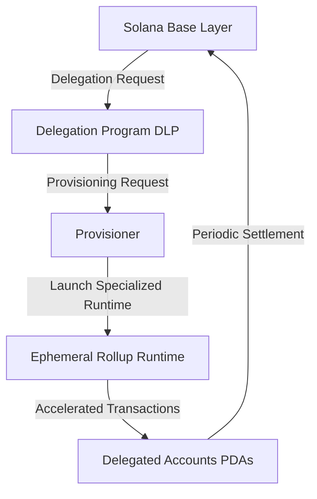
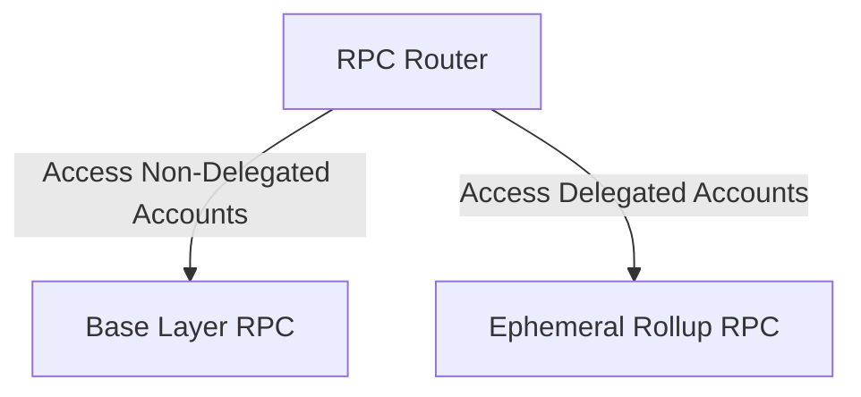

The introduction of Ephemeral Rollups (ERs) represents a significant economic innovation in blockchain scalability. By enabling high-throughput, low-latency execution without fragmenting the base layer, ERs allow developers to achieve massive performance gains while maintaining composability with existing decentralized applications and protocols. The primary economic implication is the dramatic reduction of operational costs for fully on-chain applications, especially games and financial services, by allowing targeted scaling without duplicating infrastructure or fragmenting user assets [[1](#1)][[2](#2)].

Ephemeral Rollups were introduced by MagicBlock, a team building the future of high-performance, fully on-chain applications. They focus on empowering developers to create real-time, decentralized experiences on Solana without sacrificing speed, security, or composability. More information can be found at [magicblock.gg](https://magicblock.gg).

Historically, scalability solutions such as Layer 2 rollups, sharding, and app-specific chains have sought to address blockchain throughput limitations. However, these approaches often introduced new issues: fragmented states, interoperability challenges, and reliance on additional trust assumptions [[1](#1)]. For instance, scaling by deploying isolated Layer 3s (L3s) or specialized sidechains typically sacrifices seamless composability, complicating user and developer experiences. Traditional horizontal scaling approaches improved transaction volume but failed to preserve the unified network effects that are critical for blockchain ecosystems [[1](#1)].

Ephemeral Rollups improve upon prior implementations by avoiding fragmentation entirely. Programs and assets remain deployed on the Solana mainnet, while only specific accounts are temporarily delegated to high-speed execution environments [[1](#1)]. This method preserves atomic composability with the base layer, allowing existing programs, infrastructure, and assets to interact seamlessly with accelerated transactions. Moreover, ERs introduce runtime flexibility including gasless transactions and custom block times without the overhead of deploying new blockchains or creating isolated ecosystems [[1](#1)]. Developers can now scale demand dynamically, matching user activity in real time.

The immediate effects of Ephemeral Rollups include enabling real-time, high-performance decentralized applications such as multiplayer games and financial services requiring low-latency execution [[1](#1)][[2](#2)]. Developers benefit from improved cost structures and easier integration with the broader Solana ecosystem. Looking forward, ERs are likely to catalyze the creation of new application categories including real-time DeFi protocols, on-chain social media, and event-driven autonomous worlds while promoting new infrastructure models based on decentralized rollup provisioning (DePIN) [[1](#1)]. As adoption grows, ERs may substantially accelerate the mainstream viability of decentralized technologies by removing critical performance bottlenecks.

In conclusion, Ephemeral Rollups represent a pivotal development in blockchain scalability. By maintaining composability while delivering on-demand performance improvements, they address the historical trade-offs that have long constrained decentralized applications. Their implementation not only reduces costs and improves user experiences but also lays the foundation for a broader expansion of the blockchain ecosystem into latency-sensitive industries. It will be exciting to watch how Ephemeral Rollups open up entirely new categories of decentralized applications over the next few years.

## References

[1] Gabriele Picco and Andrea Fortugno. *Ephemeral Rollups are All You Need*. arXiv:2311.02650 [cs.DC]. <https://arxiv.org/abs/2311.02650>.

[2] Andrea Fortugno and Gabriele Picco. *Breakpoint 2023: A Framework for On-Chain Gaming*. Breakpoint Conference. <https://www.youtube.com/watch?v=LQOpP8-EBkg>.